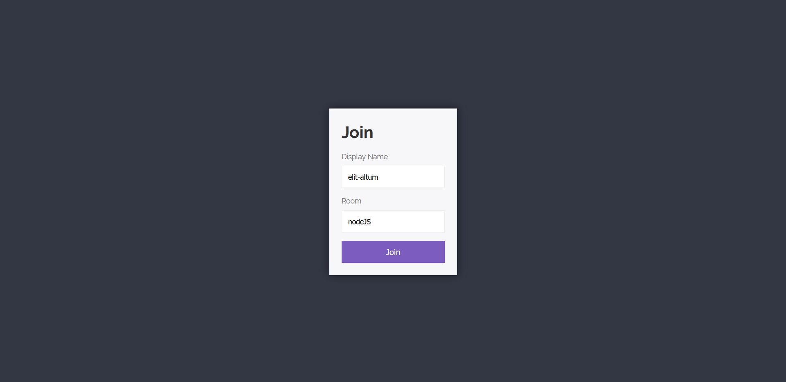
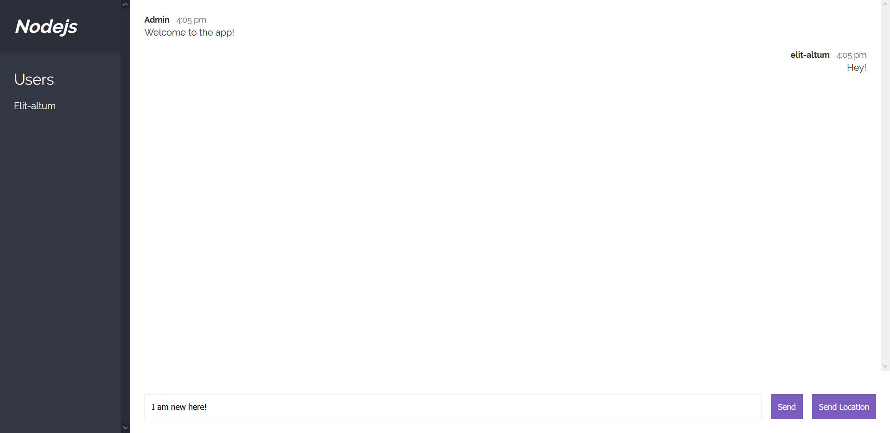
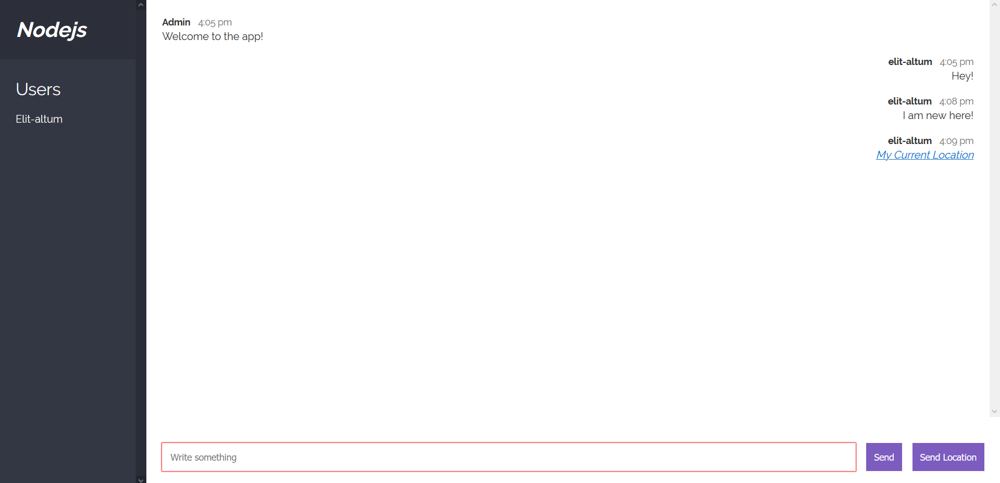
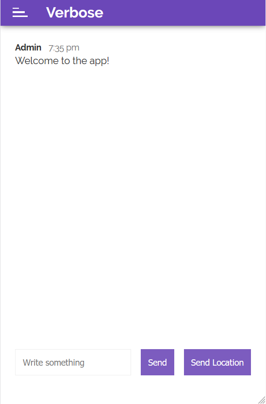
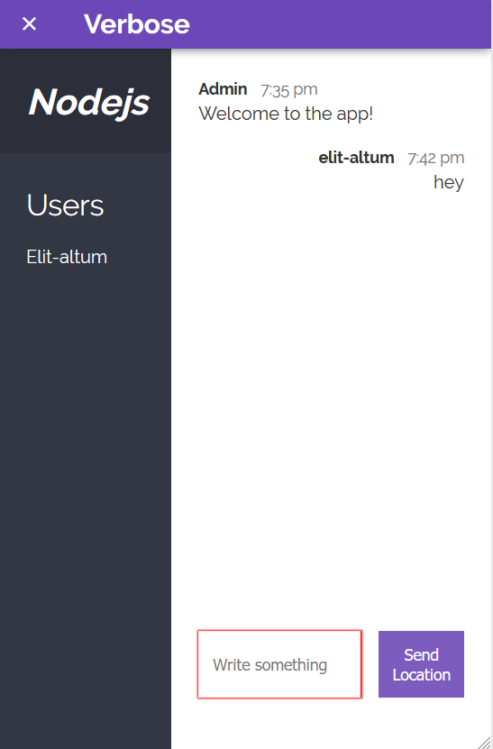

# Verbose - The Chat App
<p>
    
    
       
</p>


<hr>

***A simple IRC like chat app built using sockets***

### Live Demo : https://elit-verbose.herokuapp.com/

### Technology Stack:
- Mustache
- NodeJS
- Socket io

## How To Use :

### 0. General Use 
- All members present in a room are shown on the sidebar along with the room name.
- *Admin* will emit all room announcements while welcoming a user or indicating when a user disconnects.

### 1. Joining a room
- Choose a display name which should be unique for that room. *(required)*
- Enter the room you want to join.
- Click on 'Join' to join that room's conversation.
- You will be greeted by a welcome message and all the other members will be notified when you join.

<p align="center">
    
</p>

### 2. Sending a message
- Type your message in the input field and hit *Enter* or click *Send* to send the message to the room.
- Blank/empty messages are not allowed and will throw an error.
- Your message should display on the right along with your username and the time of send.

<p align="center">
    
</p>

### 3. Sending your location
- Click on *Send Location* action button to send your current location.
- Allow your browser to access your location.
- If allowed, the *Send Location* button will get disabled while the location is being sent.
- Your location will then be sent to the room as a __Google Maps__ link, with your coordinates. *(My Current Location)*
- If not allowed, or any other network hindrance an alert box will display the error message.

<p align="center">
    
</p>

### Extra Features :
1. __Responsive for mobile__ :
    - On screens lesser than *600px* width, the sidebar collapses and a header takes it place which allows access to the sidebar.
    - This allows for more focused display of the chat screen and the chat history.
<br>
<p align="center">


</p>  

2. __Auto-Scroll__ : 
    - If the user is at the bottom of the screen when a new message appears, the viewport will automatically scroll down to show the new message received.
    - If not, the viewport will not scroll down to allow the user to read through the previously sent messages.

## Installation and Use (for Dev)
```
npm install

// to run nodemon
npm run dev
```

### Detailed technology stack :
1. __Express__ : For deployment on Heroku App and create a local server for nodemon and testing.
2. __Mustache__ : For making the message and location message templates which are rendered on screen.
3. __Socketio__ : For creating sockets to enable real-time two way communication between server and client. Majority of the app is handled using io.
4. __MomentJS__ : For handling message timestamps and dates.
5. __Browser's GeoLocator__ : For handling the location coordinates of the user. *Not available before IE 11.*
